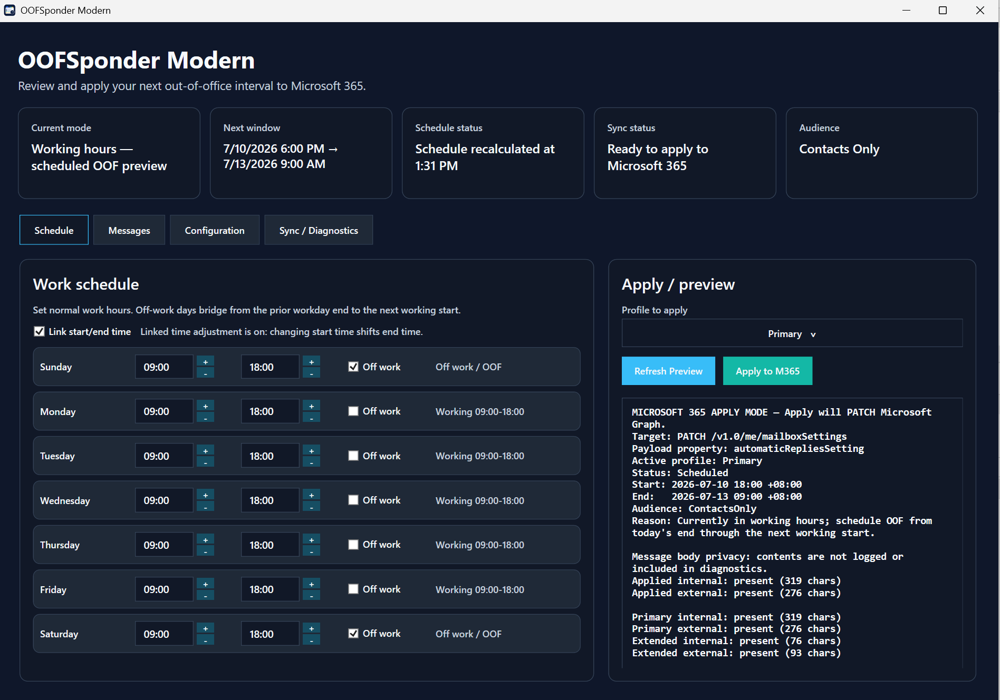

# OOFSponderModern

OOFSponderModern calculates the next out-of-office interval from your weekly working hours and lets you review and manually apply that interval to Microsoft 365.

It is a Windows WPF app targeting .NET 10. It does not run a background scheduler or automatically create later recurring intervals. Reopen the app and apply again when a new interval is needed.

## Screenshot



## Features

- Weekly working-hours editor with off-work days and 30-minute adjustment buttons.
- Optional linked start/end adjustments that preserve the workday duration.
- Primary and Extended internal/external message profiles.
- External audience choices: `None`, `Contacts Only`, and `All External`.
- Sanitized review-before-apply prompt and result banner.
- Microsoft Graph readback of current automatic-reply status without importing or exposing message bodies.
- Local rule-based message suggestions; no external text-generation service is called.
- Light/dark mode with Productivity Blue, Trust Navy, Teal Mint, and Premium Gold palettes.
- First-run guidance, automatic local settings persistence, and single-instance startup.
- DST-aware calculation of future local working times.

## Credits / Origin

This project is inspired by and references the original [EvanBasalik/OOFSponder](https://github.com/EvanBasalik/OOFSponder) project.

This repository is a modern rewrite focused on WPF, Microsoft Graph, and GitHub-based distribution instead of ClickOnce.

## Install

Tagged releases publish a self-contained Windows x64 archive named `OOFSponderModern-win-x64.zip` on the repository's [Releases page](https://github.com/tloy1966/OOFSponderModern/releases). If no tagged release is available yet, build from source using the instructions below.

Extract the archive and run `OOFSponderModern.exe`. The packaged build includes the required .NET runtime and does not use ClickOnce.

## New-user defaults

- Monday through Friday: `9:00 AM`–`6:00 PM`.
- Saturday and Sunday: `Off work`.
- External audience: `Contacts Only`.
- Primary profile selected for Microsoft 365 apply.

Existing installations retain their saved schedule, including older `9:00 AM`–`5:00 PM` values. The app does not overwrite or migrate user-edited working hours.

## Build and run from source

Requirements:

- Windows
- .NET 10 SDK

```powershell
dotnet build .\OOFSponder.sln --configuration Release
dotnet run --project .\OOFSponderModern\OOFSponderModern.csproj --configuration Release
```

Run the console scheduler regression checks:

```powershell
dotnet run --project .\OOFSponderModern.Tests\OOFSponderModern.Tests.csproj --configuration Release
```

The regression harness covers scheduler boundaries, all-off-work behavior, linked time adjustment, production default hours, and a daylight-saving transition.

Create the self-contained Windows x64 archive locally:

```powershell
.\SupportingFiles\publish-modern-github.ps1 -Configuration Release -Runtime win-x64
```

The archive is written to `artifacts\OOFSponderModern-win-x64.zip`.

## Usage

### Schedule

Set normal working hours and mark non-working days as `Off work`. The app calculates one next OOF interval:

- Before work: now through today's start.
- During work: today's end through the next working start.
- After work or on an off-work day: now through the next working start.
- If every day is off: now through one week later.

Choose the Primary or Extended profile under `Profile to apply`, review the sanitized preview, then select `Apply to M365`. The app asks for confirmation before sending changes.

### Messages

Edit the Primary and Extended internal/external replies. Message suggestions are generated locally and remain temporary until `Apply suggestion` copies them into a profile.

Audience Scope controls external replies only:

- **None**: no external automatic reply is sent. The saved external draft remains editable, but the Graph update sends an empty external message.
- **Contacts Only**: external replies are sent only to people in your contacts.
- **All External**: external replies are sent to all external senders.

Internal users always receive the selected profile's internal reply.

### Configuration

Configuration is grouped by purpose:

- Appearance: light/dark mode and color palette.
- Schedule Behavior: linked start/end time adjustment.
- Microsoft 365 Safety: review behavior and selected apply profile.
- Local App Settings: persistence and centered window behavior.

### Sync / Diagnostics

`Load current M365 settings` performs a display-only read. It shows mailbox status, audience, scheduled dates, and whether messages are present, including character counts. It does not replace local schedule, audience, or message editors.

Recent activity is sanitized; message bodies are omitted.

## Microsoft 365 behavior and permissions

OOFSponderModern uses MSAL public-client authentication with the Windows broker and requests these delegated scopes:

- `user.read`
- `MailboxSettings.ReadWrite`

The app uses `GET https://graph.microsoft.com/v1.0/me/mailboxSettings` for display-only readback and `PATCH https://graph.microsoft.com/v1.0/me/mailboxSettings` to update the nested `automaticRepliesSetting` object.

Apply behavior:

- Always sets automatic replies to `scheduled`.
- Sends the calculated start/end using the local Windows time-zone ID.
- Sends only the selected Primary or Extended profile.
- Maps audience to Graph values `none`, `contactsOnly`, or `all`.
- Sends an empty external reply when audience is `None`.
- Does not merge with or automatically import existing remote settings.

## Local data

User settings are stored at:

```text
%APPDATA%\OOFSponderModern\usersettings.json
```

The file contains the weekly schedule, messages, audience, selected profiles, theme, palette, linked-time preference, first-run guidance state, window size, sync state, and recent sanitized activity. Most edits are saved after a short debounce, with a final save when the main window closes.

Authentication tokens are cached separately by MSAL at:

```text
%LOCALAPPDATA%\OOFSponderModern\msalcache.bin3
```

The app opens centered and restores only the previous window dimensions, not the prior monitor position or maximized state.

## Releases

The release workflow validates a semantic version, runs the regression harness, builds the solution, creates `OOFSponderModern-win-x64.zip`, uploads the Actions artifact, and creates or updates the corresponding GitHub Release. A release is published only after all preceding steps succeed.

### Option 1: push a version tag

```powershell
git tag v1.0.0
git push origin v1.0.0
```

Any pushed tag matching `v*` starts the workflow. The tag must be a semantic version such as `v1.0.0` or `v1.0.0-beta.1`.

### Option 2: run the workflow in GitHub

1. Open the repository's **Actions** tab.
2. Select **Release OOFSponderModern**.
3. Select **Run workflow**.
4. Enter a version such as `v1.0.0`.
5. Run the workflow.

Manual dispatch creates or updates the same public GitHub Release; no local tag command is required. If that release version already exists, its ZIP asset is replaced.

## Repository layout

- `OOFSponderModern/` — WPF app source.
- `OOFSponderModern.Tests/` — console scheduler regression harness.
- `SupportingFiles/publish-modern-github.ps1` — self-contained Windows publish script.
- `.github/workflows/release.yml` — tag-triggered or manually dispatched release workflow.
